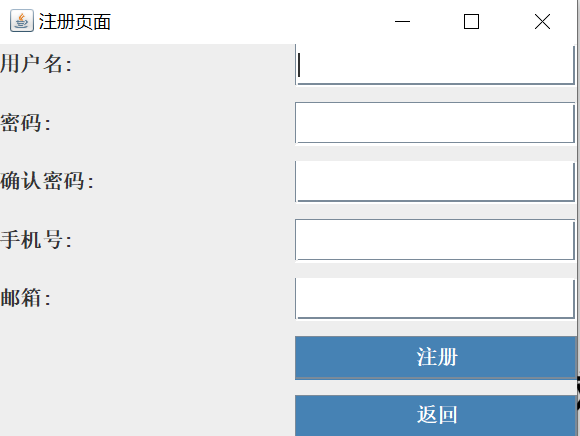
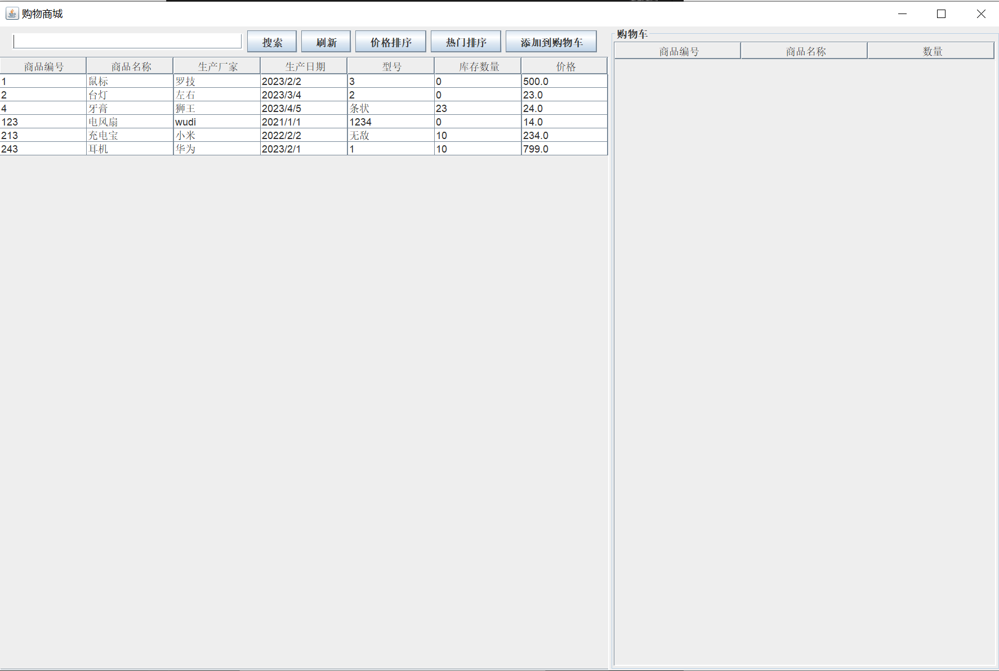
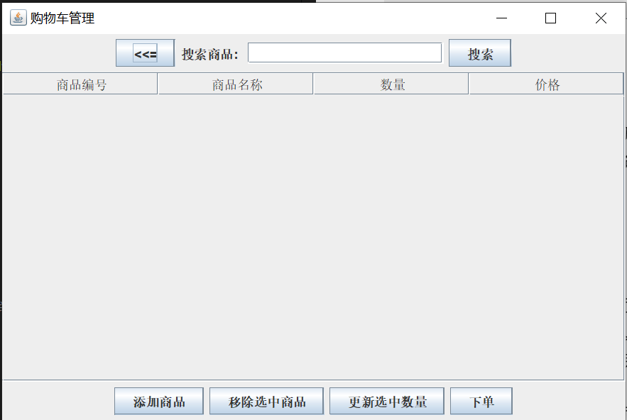
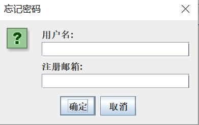

#购物系统项目
# 购物系统项目概述

## 目的

本购物系统项目的目的是创建一个初步的电子商务平台，使用户能够方便快捷地浏览商品、选择商品、添加到购物车并进行结算。此项目旨在展示如何开发一个简单但实用的购物系统，涵盖了常见电商网站的基本功能。

## 特点

- **简洁直观**: 用户友好的界面设计，使用户能够轻松浏览、选择商品。
- **购物车管理**: 提供购物车功能，方便用户随时查看已选商品和数量。
- **订单结算**: 用户可以快速生成订单并完成购买流程。
- **商品管理**: 管理员可以管理商品信息，包括添加、编辑和删除商品。
- **用户认证**: 提供用户注册和登录功能，加密存储保护用户信息的安全。

## 功能

1. **商品展示**
   - 显示各类商品，包括商品型号、名称、价格等信息。

2. **购物车**
   - 用户可以将商品添加到购物车，管理购物车中的商品数量。

3. **结算**
   - 用户可以查看购物车中的商品并进行结算，生成订单。

4. **商品管理（管理员）**
   - 管理员可以添加、编辑、删除商品和用户信息。

5. **用户认证**
   - 用户可以注册新账户，已注册用户可以登录进行购物。

## 解决的问题

本项目解决了用户在购买商品时的选择困难，提供了一个清晰的商品展示和购物车管理系统，使用户能够轻松快捷地购买所需商品。


# 使用说明

### 用户登录信息
管理员是唯一一个，而用户可以多个注册
| 用户类型   | 用户名   | 密码      |
|------------|----------|-----------|
| 管理员     | admin    | ynuadmin |
| 普通用户   | jack    | AASSdd121212. |


### 用户注册
1. 打开购物系统应用。
2. 点击注册按钮。
3. 输入所需的注册信息，包括用户名、密码(大小写字母，数字，标点符号，八位以上)、电子邮箱（用于找回密码）等。
4. 点击注册，完成注册过程。
   
   
   
### 浏览商品
1. 在登录后，系统将显示各类商品。
2. 点击感兴趣的商品，查看商品详情，包括商品图片、名称、价格等信息。


### 添加商品到购物车
1. 在浏览商品页面，点击“加入购物车”按钮。
2. 系统将提示选择商品数量，选择合适的数量后确认。(数量不够或者不存在则不能添加)
3. 商品将被添加到购物车。


### 结账和支付
1. 点击购物车图标或进入购物车页面。
2. 在购物车中确认所选商品和数量。（商品和数量需要在数据库中访问得到）
3. 点击结算按钮，系统将引导用户完成支付流程。
4. 输入支付信息并完成支付。
5. 订单将生成，用户可以在订单页面查看订单状态和详情。

注意：确保已登录才能完成购物和结账过程。

### 忘记密码
1. 需要正确的电子邮件的格式，才能收到该邮件
2. 同时需要该用户名下的邮件地址


## 安装和运行

1. 安装依赖
    ```
    依赖的各种库，如 sqlite-jdbc、Java EE 6 和 activation。
    ```
   
3. 配置数据库
   ```
   - 打开`mobile/identifier.sqlite`文件并配置数据库连接信息。
   ```

## 演示地址

你可以在以下链接中访问我们的在线演示：

- [购物系统演示](链接：https://pan.baidu.com/s/1_FDTINOEMc_YRaUbRvoFVw?pwd=1211 
提取码：1211)


## 作者

- 董圣杰


## 联系方式

如果您有任何问题或建议，请随时通过电子邮件联系我们：

- 董圣杰: 1239217122@qq.com


## 你的点赞鼓励，是我们前进的动力~